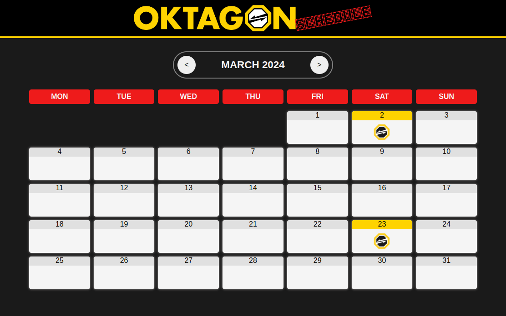

 
 

# Introduction

### Web application with a schedule of past and upcoming events of the Oktagon MMA organization.

 
 

# Used technologies

 

 
 

# Time spent

 

_**( this badge is linked to the original JS repo, which was later transformed into this TypeScript repo )**_

 
 

# Preview

 

 

